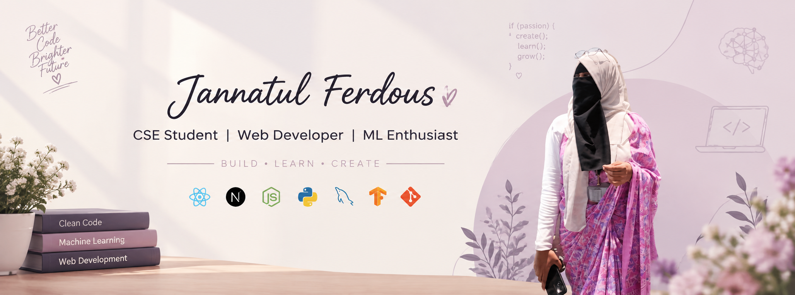

 

# 👋 Hi, I'm Jannatul Ferdous

### CSE Student | Web Developer | ML Enthusiast

---

## 👩‍💻 About Me

I'm a Computer Science and Engineering student passionate about
web development, software engineering, and machine learning.

I enjoy building practical projects, learning new technologies,
and exploring how technology can be used to solve real-world problems.

I'm currently focused on improving my development skills while
working on academic, research, and personal projects.

---

## 🚀 Currently

- 🌱 Exploring **Next.js** and modern web development
- 💻 Building and improving **full-stack web applications**
- 🤖 Exploring **Machine Learning and Deep Learning**
- 🔬 Working on a **multimodal breast cancer research project**
- 📚 Strengthening my skills in software development and problem solving
- 🌐 Building projects that combine learning with practical applications

---

## 🛠️ Technologies & Tools

### 👩‍💻 Programming & Web

  

### 🐍 Programming & Data

  

### 🗄️ Database & Tools

  

### 🤖 Machine Learning

  

---

## 🌐 Connect With Me

---

## 📊 GitHub Statistics

---

## 🔥 GitHub Streak

---

## 🚀 Featured Projects

---

## 💡 What I'm Interested In

- 🌐 Full-Stack Web Development
- ⚛️ React & Next.js
- 🤖 Machine Learning & Deep Learning
- 🧠 Artificial Intelligence
- 📊 Data Analysis
- 🔬 Research & Applied Machine Learning
- 💻 Software Engineering

---

### ✨ Build • Learn • Create ✨

Thanks for visiting my profile! 💜

